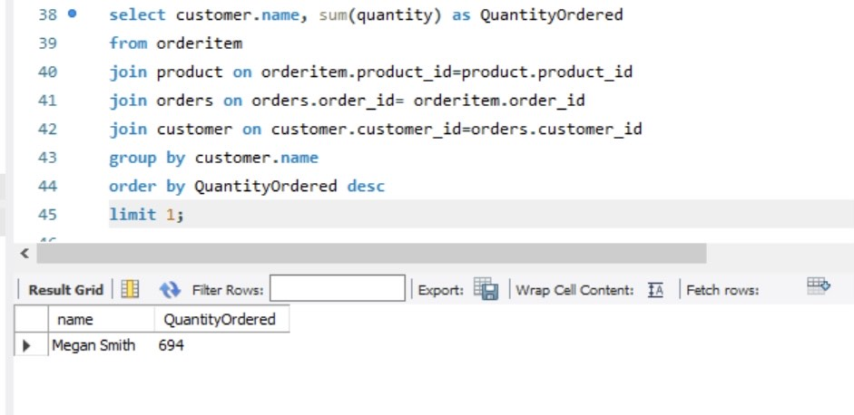

## DATA SOURCE
This data was gotten from the Gadget Sales Dataset

## PROJECT DETAILS
Mr. Chinedu has a shop where he sells different kinds of gadgets. He needs answers for some of his 
crucial business question.

## QUESTIONS
1. Which device had the most sales by quantity?
2. Which device had the lowest sales by quantity?
3. Top 3 most expensive gadgets.
4. Top 3 customer names that spent the most. (Hint: Sum of product of price and quantity)
5. Which order date did the least quantity of gadget sold?
6. Which customer name had the most orders by quantity?
7. List 3 devices with the lowest sales by quantity.
8. On which order date did “iPad Pro” had the most sales by quantity?
9. Which customer name bought “iPhone 13” the most by quantity?
10. Between the cheapest device and the most expensive device, which had more quantity 
sold? And why is the result so?

## ANSWERS
1. Which device had the most sales by quantity?

2. Which device had the lowest sales by quantity?

3. Top 3 most expensive gadgets.

4. Top 3 customer names that spent the most. (Hint: Sum of product of price and quantity)

5. Which order date did the least quantity of gadget sold?

6. Which customer name had the most orders by quantity?

7. List 3 devices with the lowest sales by quantity.

8. On which order date did “iPad Pro” had the most sales by quantity?

9. Which customer name bought “iPhone 13” the most by quantity?

10. Between the cheapest device and the most expensive device, which had more quantity 
sold? And why is the result so?

